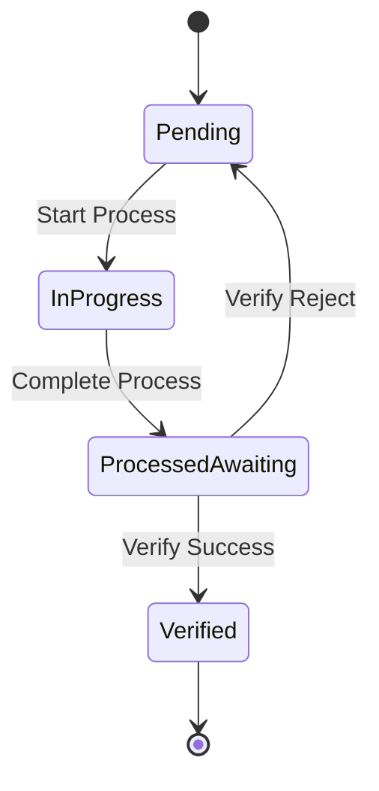

# Design Document

## Overview

The Production Alerts Management system is a Vue.js-based web application that provides comprehensive management of production alerts throughout their lifecycle. The system follows the existing application architecture patterns, utilizing Element UI components, Vuex for state management, and a RESTful API backend. The design emphasizes user experience with real-time updates, intuitive status workflows, and role-based access control.

## Architecture

### Frontend Architecture
- **Framework**: Vue.js 2.x with Element UI component library
- **State Management**: Vuex for global state management
- **Routing**: Vue Router for navigation
- **HTTP Client**: Axios with custom request interceptors
- **Build Tool**: Vue CLI with Webpack

### Backend Integration
- **API Communication**: RESTful API endpoints following existing patterns
- **Authentication**: JWT-based authentication with role-based permissions
- **Data Format**: JSON request/response format
- **Error Handling**: Standardized error response format

### Component Structure
```
src/views/production-management/
├── alerts/
│   ├── index.vue                    # Main alerts management page
│   ├── components/
│   │   ├── AlertForm.vue           # Create/Edit alert form
│   │   ├── AlertDetail.vue         # Alert detail view
│   │   ├── ProcessDialog.vue       # Process management dialog
│   │   ├── VerifyDialog.vue        # Verification dialog
│   │   ├── LargeScreenView.vue     # Large screen dashboard
│   │   └── AlertFilters.vue        # Search and filter component
│   └── styles/
│       └── alerts.scss             # Component-specific styles
```

## Components and Interfaces

### 1. Main Alert Management Page (index.vue)

**Purpose**: Central hub for alert management with comprehensive CRUD operations

**Key Features**:
- Paginated data table with sorting and filtering
- Bulk operations (delete, status updates)
- Real-time status updates
- Export functionality
- Role-based action buttons

**Data Structure**:
```javascript
{
  searchForm: {
    workOrderNo: '',
    categoryName: '',
    computerName: '',
    processType: null,
    reporter: '',
    responsible: '',
    responsibleDept: '',
    processName: '',
    startTime: null,
    endTime: null
  },
  tableData: [],
  pagination: {
    current: 1,
    size: 20,
    total: 0
  },
  selectedRows: [],
  loading: false
}
```

### 2. Alert Form Component (AlertForm.vue)

**Purpose**: Unified form for creating and editing alerts

**Props**:
- `visible`: Boolean - Dialog visibility
- `editData`: Object - Alert data for editing (null for create)
- `categoryOptions`: Array - Available categories
- `computerOptions`: Array - Available computer models

**Events**:
- `success`: Emitted when form submission succeeds
- `cancel`: Emitted when form is cancelled

**Validation Rules**:
- Work Order Number: Required, unique validation
- Category Name: Required, dropdown selection
- Computer Name: Required, dropdown selection
- Problem Description: Required, max 500 characters
- Reporter: Required, current user default

### 3. Process Management Dialog (ProcessDialog.vue)

**Purpose**: Handle alert processing workflow

**Features**:
- Start processing (status: Pending → In Progress)
- Complete processing (status: In Progress → Processed Awaiting Verification)
- Real-time duration tracking
- Process notes and comments

**State Transitions**:


### 4. Verification Dialog (VerifyDialog.vue)

**Purpose**: Quality control verification of completed alerts

**Features**:
- Approve resolution (status: Processed Awaiting Verification → Verified)
- Reject resolution (status: Processed Awaiting Verification → Pending)
- Verification comments
- Verification timestamp recording

### 5. Large Screen Dashboard (LargeScreenView.vue)

**Purpose**: Real-time monitoring display for production floor

**Features**:
- Auto-refresh every 30 seconds
- Display only active alerts (Pending, In Progress)
- Large, readable fonts and colors
- Alert priority highlighting
- Processing duration warnings

**Layout**:
- Grid-based responsive layout
- Color-coded status indicators
- Minimal UI for distance viewing
- Auto-scroll for multiple alerts

### 6. Alert Filters Component (AlertFilters.vue)

**Purpose**: Advanced search and filtering capabilities

**Filter Options**:
- Work Order Number (text input with autocomplete)
- Category Name (dropdown with search)
- Computer Name (dropdown with search)
- Process Status (multi-select dropdown)
- Reporter (user search)
- Responsible Person (user search)
- Responsible Department (department tree)
- Process Name (user search)
- Date Range (date picker)

## Data Models

### Alert Data Model
```javascript
{
  id: String,                    // Primary key
  workOrderNo: String,           // Work order number
  categoryName: String,          // Product category
  computerName: String,          // Computer model
  problemDesc: String,           // Problem description
  processType: Number,           // 0-No Processing, 1-Pending, 2-In Progress, 3-Processed Awaiting, 4-Verified
  reporter: String,              // Reporter name
  responsible: String,           // Responsible person
  responsibleDept: String,       // Responsible department
  processName: String,           // Processor name
  processStartTime: String,      // Process start time
  processEndTime: String,        // Process end time
  processTime: String,           // Processing duration (milliseconds)
  processDuration: String,       // Formatted duration string
  verificationTime: String,      // Verification time
  remark: String,                // Additional remarks
  createdTime: String,           // Creation timestamp
  isDel: Number                  // Deletion status (0-Normal, 1-Deleted)
}
```

### API Response Model
```javascript
{
  code: Number,                  // Status code (200 for success)
  msg: String,                   // Response message
  data: Object | Array           // Response data
}
```

### Pagination Model
```javascript
{
  list: Array,                   // Data array
  pageNum: Number,               // Current page
  pageSize: Number,              // Page size
  pages: Number,                 // Total pages
  total: Number                  // Total records
}
```

## Error Handling

### API Error Handling
- **Network Errors**: Display connection error messages with retry options
- **Validation Errors**: Highlight form fields with specific error messages
- **Permission Errors**: Redirect to login or show access denied message
- **Server Errors**: Display user-friendly error messages with error codes

### Form Validation
- **Client-side Validation**: Real-time validation using Element UI rules
- **Server-side Validation**: Handle backend validation errors gracefully
- **Required Fields**: Clear visual indicators for mandatory fields
- **Data Format**: Validate data types and formats before submission

### Error Recovery
- **Auto-retry**: Implement retry logic for transient network errors
- **Data Persistence**: Save form data locally to prevent data loss
- **Graceful Degradation**: Provide alternative functionality when features fail

## Testing Strategy

### Unit Testing
- **Component Testing**: Test individual Vue components with Vue Test Utils
- **API Service Testing**: Mock API calls and test service functions
- **Utility Function Testing**: Test helper functions and data transformations
- **Validation Testing**: Test form validation rules and error handling

### Integration Testing
- **API Integration**: Test actual API endpoints with test data
- **Component Integration**: Test component interactions and data flow
- **Route Testing**: Test navigation and route guards
- **State Management**: Test Vuex actions, mutations, and getters

### End-to-End Testing
- **User Workflows**: Test complete user journeys from login to task completion
- **Cross-browser Testing**: Ensure compatibility across different browsers
- **Responsive Testing**: Test functionality on different screen sizes
- **Performance Testing**: Test loading times and responsiveness

### Test Data Management
- **Mock Data**: Create realistic test data for development and testing
- **Test Environment**: Separate test database with controlled data
- **Data Cleanup**: Automated cleanup of test data after test runs
- **Seed Data**: Consistent baseline data for testing scenarios

## Security Considerations

### Authentication & Authorization
- **JWT Tokens**: Secure token-based authentication
- **Role-based Access**: Different permissions for different user roles
- **Session Management**: Automatic logout on token expiration
- **Permission Guards**: Route and component-level permission checks

### Data Protection
- **Input Sanitization**: Prevent XSS attacks through input validation
- **SQL Injection Prevention**: Use parameterized queries on backend
- **Data Encryption**: Encrypt sensitive data in transit and at rest
- **Audit Logging**: Track all data modifications with user attribution

### API Security
- **HTTPS Only**: All API communications over secure connections
- **Rate Limiting**: Prevent abuse through request rate limiting
- **CORS Configuration**: Proper cross-origin resource sharing setup
- **Input Validation**: Server-side validation of all input data

## Performance Optimization

### Frontend Performance
- **Lazy Loading**: Load components and routes on demand
- **Virtual Scrolling**: Handle large data sets efficiently
- **Debounced Search**: Reduce API calls during user input
- **Caching**: Cache frequently accessed data and API responses

### API Performance
- **Pagination**: Limit data transfer with proper pagination
- **Filtering**: Server-side filtering to reduce data transfer
- **Compression**: Enable gzip compression for API responses
- **Connection Pooling**: Efficient database connection management

### User Experience
- **Loading States**: Clear loading indicators during data operations
- **Optimistic Updates**: Update UI immediately for better responsiveness
- **Error Recovery**: Quick recovery from errors without full page reload
- **Offline Support**: Basic functionality when network is unavailable

## Accessibility

### WCAG Compliance
- **Keyboard Navigation**: Full functionality accessible via keyboard
- **Screen Reader Support**: Proper ARIA labels and semantic HTML
- **Color Contrast**: Sufficient contrast ratios for text and backgrounds
- **Focus Management**: Clear focus indicators and logical tab order

### Responsive Design
- **Mobile Support**: Functional interface on mobile devices
- **Touch Targets**: Appropriately sized touch targets for mobile
- **Flexible Layouts**: Layouts that adapt to different screen sizes
- **Progressive Enhancement**: Core functionality works without JavaScript